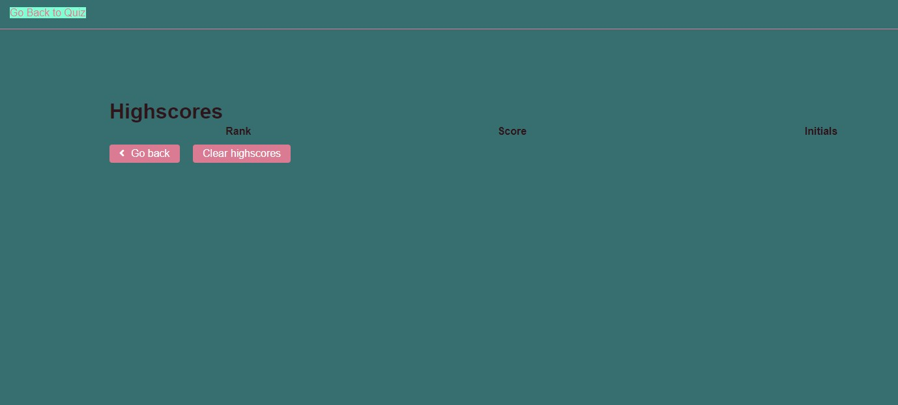
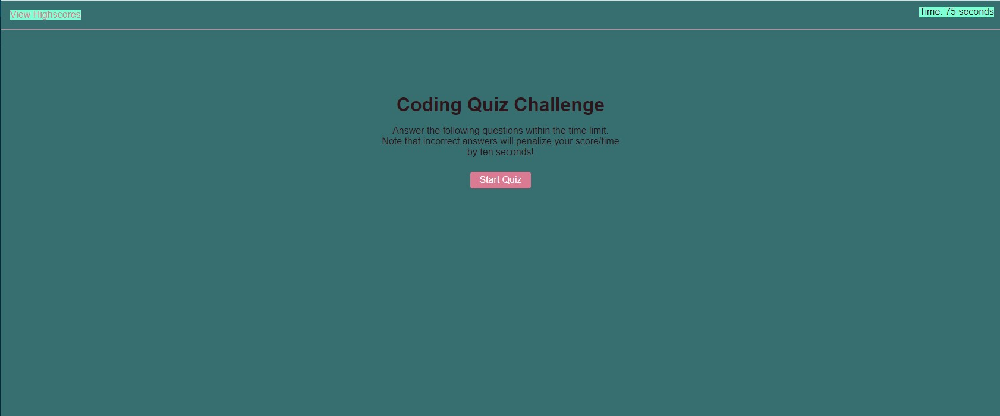

#JavaScrip Quiz https://blerandism.github.io/coding-questionary/
- This weekly challenge required usage of HTML, CSS and JavaScript to create a functional online quiz
- The quiz is made of 5 question, each one has 4 alternatives with one correct answer.
- The alternatives are acting like buttons and when the user presses it depending on the answer it gets a response back
- The quiz is timed at 75 seconds and for every wrong answer 10 seconds are deducted 
- The quiz ends when the seconds hit 0 or when the user has answered all the questions
- In the end of the quiz the user has the chance to add their initial to save the score and compare it thanks to local storage where they can save all the results 
- To see the highscore the user is sent to a different website where they can delete the score or come back to the test

- 
- 

# Contributors 
- **Blerand Ismaili** https://github.com/BlerandIsm/coding-questionary